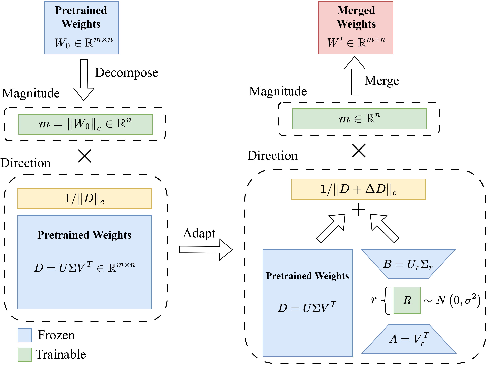

# EDoRA: Efficient Weight-Decomposed Low-Rank Adaptation via Singular Value Decomposition

Code for the paper: "[EDoRA: Efficient Weight-Decomposed Low-Rank Adaptation via Singular Value Decomposition](https://arxiv.org/abs/...)"

## Introduction
We introduce **EDoRA** (Efficient Weight-Decomposed Low-Rank Adaptation), a highly parameter-efficient PEFT method that leverages a decomposition strategy and SVD-based initialization to overcome the scalability and learning pattern limitation of existing PEFT methods.
EDoRA decomposes pre-trained weights into magnitude and directional components. By freezing low-rank matrices, initializing them by singular value decomposition, and introducing a small trainable matrix between them, EDoRA achieves substantial reductions in trainable parameters while maintaining learning capacity. Experimental results on the GLUE benchmark demonstrate that in terms of average performance over six different tasks, EDoRA outperforms LoRA and other state-of-the-art methods, such as DoRA, with up to 30x fewer trainable parameters. This makes EDoRA a highly efficient solution for adapting LLMs to diverse tasks under memory-constrained settings.

<p align="center">
  
  <br> An overview of EDoRA.
</p>
  
## Requirements
We recommend running the scripts inside a conda environment.
You can run the following commands to create the conda environment, as well as installing needed libraries:
```bash
git clone https://github.com/Hamid-Nasiri/EDoRA.git
conda create -n edora python=3.8.13
conda activate edora
cd EDoRA ; pip install -r requirements.txt
```
## Quickstart
EDoRA is built on top of [HuggingFace Transformers](https://huggingface.co/docs/transformers/en/index), [PEFT libraries](https://huggingface.co/docs/peft/en/index) and [LoRA-XS](https://github.com/MohammadrezaBanaei/LoRA-XS). Initially, DoRA modules are integrated into the model in the standard manner. Subsequently, the `find_and_initialize` function iterates through these DoRA modules. During this process, each DoRA module is converted into an EDoRA module. This conversion entails two key steps:

1. Performing truncated Singular Value Decomposition (SVD) on the pre-trained weights associated with the frozen A and B matrices.

2. Incorporating an r x r matrix (represented as matrix R in the figure above) into the module.


## GLUE Experiments
To reproduce our GLUE results, please run the `scripts/run_glue.py` script as follows (using the QNLI task as an example):
	
```bash
python scripts/run_glue.py --target_task qnli
```

## Citation
If you use this code for your research, please cite the following paper:
```
@article{nasiri2025edora,
  title={EDoRA: Efficient Weight-Decomposed Low-Rank Adaptation via Singular Value Decomposition},
  author={Nasiri, Hamid and Garraghan, Peter},
  journal={arXiv preprint arXiv:...},
  year={2025}
}
```

